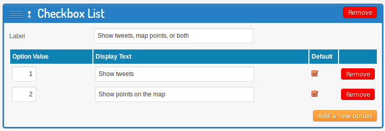

Laertes
=======

Laertes provides channels in the augmented reality application [Layar](http://www.layar.com/) for people together at the same event or conference.  It pulls together points of interest from group-annotated Google Maps and from geolocated and hashtagged tweets on Twitter and displays them in Layar's Geo Vision view.

With Laertes and Layar you can hold up your smartphone and pan around and see where all of the interesting places are and where everyone's been tweeting from in the last little while.

## Requirements

Laertes is written in [Ruby](http://www.ruby-lang.org/en/) using the [Sinatra](http://www.sinatrarb.com/) web application framework.  There is no database---it does everything on the fly by calling APIs.

You will need to have Ruby and [Rubygems](http://rubygems.org/) installed for this to work.  You can either do that through a package manager or by using [RVM](https://rvm.io/), which is probably easiest in the long run and will help you avoid problems with different Ruby versions.

For the Ruby XML parser `nokogiri` to run [there are extra installation requirements](http://nokogiri.org/tutorials/installing_nokogiri.html). On a Debian/Ubuntu system you will need to run this (but don't run the Ruby installation commands they mention if you're set up with RVM):

    $ sudo apt-get install libxslt1-dev libxml2-dev

If you run a different system, check Nokogiri's instructions.

You will also need [Git](http://git-scm.com/) to get this source code.

    $ sudo apt-get install git

While I'm at it, let me recommend two other useful tools: [curl](http://curl.haxx.se/) and [jsonlint](https://github.com/zaach/jsonlint).

    $ sudo apt-get install curl
    $ sudo apt-get install npm
	$ npm install jsonlint -g

All of these installation commands are meant for Debian/Ubuntu; adapt them to your system if you run something different.

## Installation

To install Laertes you need to get this source code by either forking this GitHub repository or downloading it directly.  Then use [Bundler](http://gembundler.com/) to first make sure all of the necessary requirements are in place and then to run the application safely.  (Note: when installing Bundler, if you're not using RVM you may need to run `sudo gem install bundler`.)  This will clone this repository and then get it running:

    $ git clone git@github.com:wdenton/laertes.git
    $ cd laertes
    $ gem install bundler
    $ bundle install
    $ bundle exec rackup config.ru

You should now see a message like this:

    [2013-01-22 10:49:56] INFO  WEBrick 1.3.1
    [2013-01-22 10:49:56] INFO  ruby 1.9.3 (2012-04-20) [x86_64-linux]
    [2013-01-22 10:49:56] INFO  WEBrick::HTTPServer#start: pid=14347 port=9292

Good! This means that the web service is running on your machine on port 9292.  You can now test it by either hitting it on the command line or in your browser at a URL like this:

    $ curl "http://localhost:9292/?lon=-87.64597&lat=41.866862&version=6.2&radius=2000&layerName=code4lib2013"

It should respond with JSON output (as defined in Layar's [GetPOIs Response](https://www.layar.com/documentation/browser/api/getpois-response/)). As long as there is some JSON, even if it's not much, that's good.  If there's an error, look at your console to see what it might be.

If you installed `jsonlint` then this will make the output more readable:

    $ curl "http://localhost:9292/?lon=-87.64597&lat=41.866862&version=6.2&radius=2000&layerName=code4lib2013" | jsonlint

## Configuration

All configuration is done in the `config.json` file.  You can use the one that's there or edit it as you like.  It's in [JSON](http://www.json.org/) and looks like this:

    [
      {
        "layer": "code4lib2013",
        "showMessage": "Use the #c4l13 hashtag and turn on geolocating for your tweets to show here.",
        "search": "#code4lib OR #c4l13",
        "google_maps": [
          "https://maps.google.com/maps/ms?msid=213549257652679418473.0004ce6c25e6cdeb0319d&msa=0",
          "https://maps.google.com/maps/ms?msid=208580427660303662074.0004d00a3e083f4d160a4&msa=0"
        ],
        "icon_url": "http://code4lib.org/files/logo.png" 
      },
      {
        "layer": "matchesthenameatlayar",
        "showMessage": "Message to show when layer is opened.",
        "search": "#this OR #that",
        "google_maps": [
        ],
      },
    ]

This is an array of objects.  Each object has these elements:

* `layer` (required): name of the layer. This must match the name used in the layer's configuration at Layar.
* `showMessage` (optional): text message that shows when the user launches the layer.
* `search` (required): the Twitter search used to find relevant tweets
* `google_maps` (optional): URLs of Google Maps listings points of interest. If there's more than one, separate with a comma.
* `icon_url` (optional): URL of an image that Layer will use when showing locations of points taken from the maps.  To one in this source tree, put it in the `public/icons/` directory and then give its full URL.  It must be 110x110 pixels.  See [Look and Feel Tab Explanation](http://www.layar.com/documentation/browser/publishing-site/look-and-feel-tab-explanation/) for more.

If you ever edit the config file, it's a good idea to use `jsonlint` to make sure it's valid:

    $ jsonlint config.json

## Deploying in production

Laertes uses [Rack](http://rack.github.com/), so you can deploy it with [Phusion Passenger](https://www.phusionpassenger.com/).

Another option is to use the hosted service [Heroku](http://www.heroku.com/).  Follow the instructions there about signing up and installing the toolkit and logging in on your system, and then do this:

    $ # [edit config.json in your favourite editor]
    $ git add config.json
	$ git commit -m "Customized config file"
	$ heroku create
	$ git push heroku master

Heroku will tell you it's set up the service for you at `some-outlandish-hostname-2112.herokuapp.com`.  Now you can query it just like you queried your local instance before (change the hostname as necessary):

    $ curl "http://some-outlandish-hostname-2112.herokuapp.com/?lon=-87.64597&lat=41.866862&version=6.2&radius=2000&layerName=code4lib2013"

## Setting up a layer in Layar

The last step is to set up a layer at [Layar](http://www.layar.com/).  Set up an account if you don't have one.  Then go to My Layers and look for the "create a new layer" option.  You will need to configure some options:

* Layer name: this must match an entry in your `config.json` file.
* Title: Human-readable title.
* Short description: A short paragraph about what this is.  You can edit it later.
* API endpoint URL: `http://some-outlandish-hostname-2112.herokuapp.com/` or whatever your Heroku URL is, or wherever it is you're hosting Laertes.
* Layer type: Set it to "3D and 2D objects in 3D space"

That will create a layer.  There are many more options you can configure, but you don't need to bother with them now.

Install the Layar app on your smartphone or tablet if you haven't already.  Go into the settings and log in.  Now, in Geo Layers mode, if you page all the way to the right through the listings of layers you'll see a page called Test that lists all of your layers.  Launch the one you created and it should work!  Depending on how you configured it, if there are any tweets or POIs nearby, you'll see them.

### Filter 1: tweets and/or map points

### Filter 2: time limits on tweets

# Using it

Tell people to:

* install Layar
* go into Geo Layers mode
* search for your layer
* look around

Tweets must be geolocated to appear.  To do this in the official Twitter client you will need to enable this in settings, and then enable it for each individual tweet you want to locate by pressing the little button icon.

# Contact information

I'm interested in hearing anything about this: William Denton <[wtd@pobox.com](mailto:wtd@pobox.com)> (and [@wdenton](https://twitter.com/wdenton)).

Bug reports, pull requests, suggestions, comments and feedback are all welcome.

